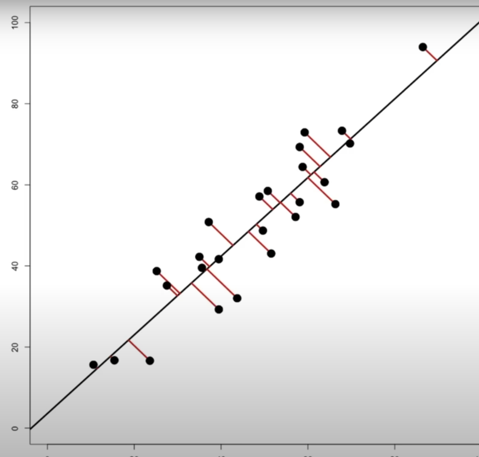

# Introduction to Modeling Data

## Hierarchical Clustering

Hierarchical clustering helps determine which cases or observations in your data belong together. Essentially, it groups "like" with "like," identifying cases that are similar to one another. The effectiveness of this method depends on your criteria for measuring similarity and distance, and several key decisions need to be made.

### Key Concepts

- **Similarity and Distance Measures**: Your choice of criteria for determining how similar or different the data points are.
- **Clustering Approaches**: You can choose between different approaches, such as hierarchical clustering or setting a predetermined number of groups.
- **Distance Measures**: Various options exist for measuring distance, with Euclidean distance being a common choice.
- **Divisive vs. Agglomerative Clustering**:
  - **Divisive Clustering**: Starts with all data points in one group and then splits them apart.
  - **Agglomerative Clustering**: Starts with each data point in its own group and then gradually merges them together.

### Our Approach

To keep things simple, we will use the most common type of clustering:

1. **Measure of Distance**: We will use Euclidean distance.
2. **Clustering Method**: Hierarchical clustering, so we don't need to set the number of groups in advance.
3. **Divisive Method**: We will start with all data points together and gradually split them apart.

## Principal Components

The idea here is that in some situations, less is more. Less noise and fewer unhelpful variables in your data can translate to more meaning. This approach is known as dimensionality reduction. The most common method is called Principal Component Analysis (PCA). As an example, you begin with two variables:

We can see a strong linear association between these two. We're going to draw a regression line into the dataset:

Then, we're going to measure the perpendicular distance of each data point from the regression line:

Next, we're going to collapse the data by sliding each point down the red line to the regression line:

Finally, we can rotate this plot:

That's how we go from 2D to 1D with the principal component.
